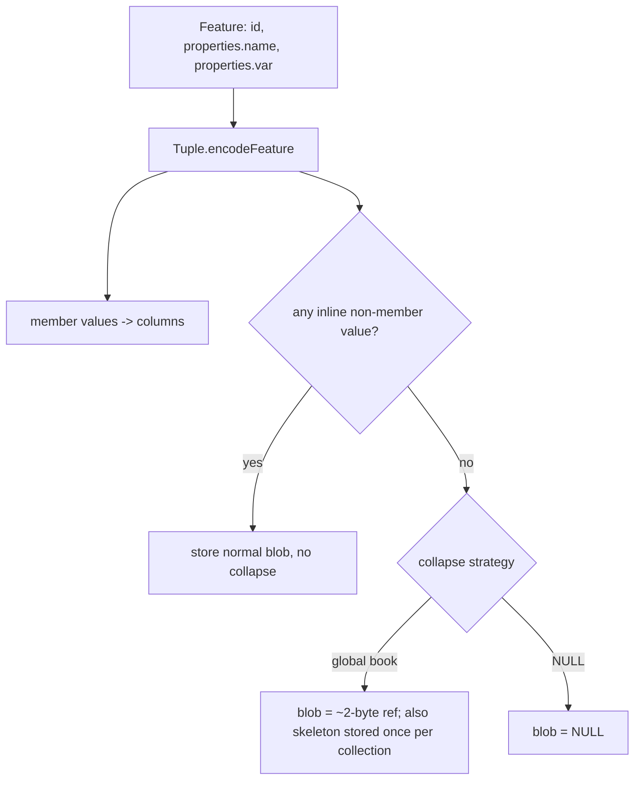
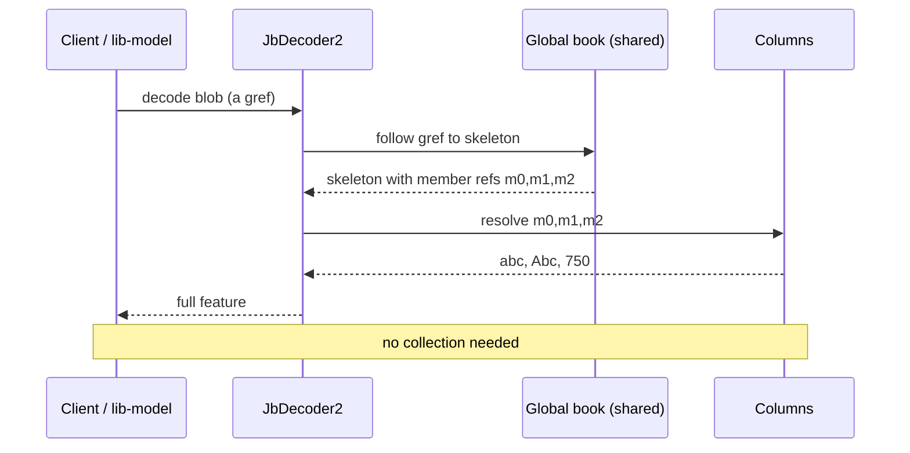
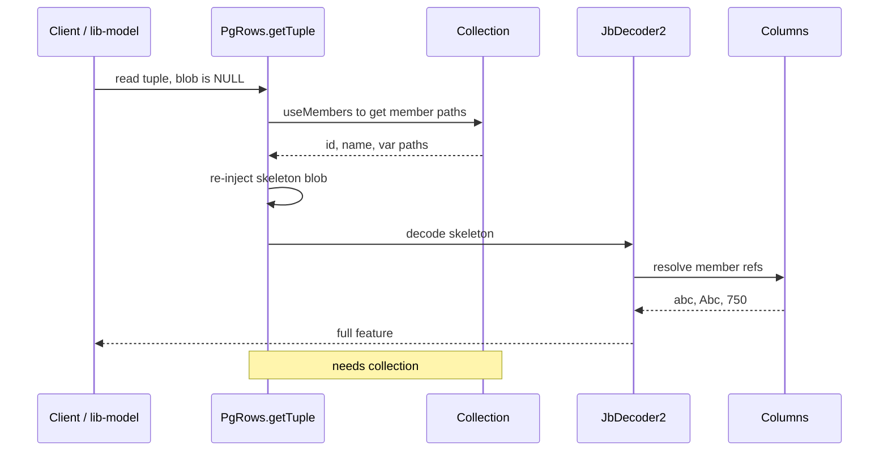

# Elimination of redundant feature-specific blob bytes

**Assumptions**
- We do feature collapse only when all of its members are declared and we're able to retrieve them. Partial collapse out of scope.
- A fully-referential feature encodes to a small (~2-byte) reference into a shared per-collection book, instead of its own blob.
- The tuple stays self-describing: it decodes without the collection, so this is not Postgres-specific.

## Problem

When every leaf of a feature is a declared member, `Tuple.encodeFeature` redirects all values into the members book,
but the blob still isn't empty. We keep keys (the feature schema) for all members, even if their values are referenced.

The keys/nesting are recoverable from each `Member.path` (on the collection) and the values from the columns, so the per-feature blob is fully redundant.

## Approach: global book

- The member-encoder hook in `JbEncoder2.encodeValue` fires for each value. A feature is
   purely referential if there is no inline value, so `JbEncoder2.encodeValue` returns -1 and the value is not a
   `MapProxy`/`ListProxy`. We collapse if no values are inlined.

- A shared per-collection global book holds the object skeleton once - the keys/structure with a member reference at each leaf.
   A fully-referential feature then encodes to a single 2-byte reference into that book.

- On decode the reference is followed transparently: the skeleton's member-refs resolve against the feature's own members book
   (its columns), reproducing the feature. No collection is needed at decode time, which would be required in order to reconstruct blob from NULL.

- It's possible currently to do transparent references into the global book, but `JbDecoder2` resolves refs as flat
   `dict.get(index)` lookups, so this requires decoder changes.Aslo, we need to associate the per-collection skeleton. 

## Gains

- Self-contained: a tuple decodes without the collection, so works in every case outside of storage layer. The NULL alternative can only rebuild inside Postgres.
- Storage-agnostic: it's a JBON2-format mechanism, so every backend gets it from one implementation, with no per-storage restore code.
- Extensible: the same shared-object concept can later strip the member part of partially-referential features and inline only the rest, in case we change our mind in terms of partial collapse support.
- No need to change guards in the storage layer to support currently unexpected NULL value.

## Alternative: NULL + storage layer restore

- Store the feature blob as NULL; on read the Postgres storage layer re-injects the skeleton blob (from `collection.head.useMembers()` paths) and lets the normal decode fill values from the columns. The result is byte-for-byte identical to a normal read.
- Conceptually simpler and no format change is required, but the implementation is storage-specific.
- 0 bytes instead of 2-bytes references
- Needs a few guards relaxed - NULL values are currently not supported, so we will be changing some of the logic around NULL handling.

## Example

Feature `{ id: "abc", properties: { name: "Abc", var: 750 } }`, all three fields declared members
(`id -> [id]`, `name -> [properties, name]`, `var -> [properties, var]`).

| layer | today | global book | NULL |
|---|---|---|---|
| columns (members book) | id=abc, name=Abc, var=750 | same | same |
| `feature` blob | ~50 B skeleton (keys + 3 refs + key strings) | ~2 B: one ref into the global book | NULL |
| shared, per collection | - | skeleton `{id:m0, properties:{name:m1, var:m2}}` stored once | — |

## Comparison

| | today | global book | NULL |
|---|---|---|---|
| per-row blob for redundant members | variable amount of bytes, depending on the schema | ~2 B | 0 |
| decode needs collection | no | no | yes |
| one impl for all storages layers | yes | yes | no |
| can extend to partial | — | possible | no |

## Workflows

Write: the only difference is the output blob:

Read: global book approach

Read: NULL approach

