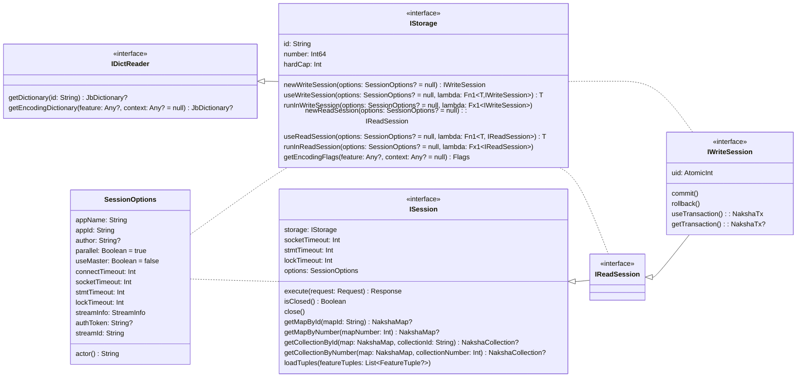
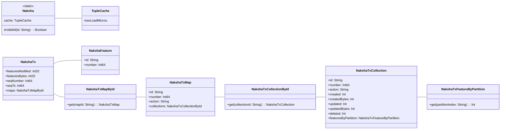

# Lib-Model
This document explains the `lib-model` data model, with the main purpose to support the concept of the **_Storage Abstraction Layer_**.

## Introduction
All classes are part of the namespace `naksha.model`, with the central entry point being the class `naksha.model.Naksha`, which holds a bunch of static methods that are quite important to use storages.

## Bootstrap with _lib-psql_
Before a storage can be used, the application should be linked against an implementation. This can be done at compile-time or at runtime, by simply adding the corresponding JAR to the classpath.

This documentation is based upon `lib-psql`, which is an implementation of the _Storage Abstraction Layer_ based upon a PostgresQL database. This document assumes, that you have linked `lib-psql` to you test application _(no matter if this is done using runtime or compile-time linking)_.

To get a temporary database that is started when the application is started, and shutdown automatically with the application, the following code can be used:

```kotlin
val nakshaStorage = NakshaStorage.fromJSON("""{
  "id": "demo",
  "className": "naksha.psql.PsqlTestStorage"
}""")
val storage = Naksha.useStorage(nakshaStorage)
```

To start your own PostgresQL docker container, that can be started, and stopped, keeping the database and config files on your host machine, the following steps can be done:

```bash
mkdir -p ~/demo
mkdir -p ~/demo/pg_data
mkdir -p ~/demo/pg_temp
# If you have ARM:
export IMG=hcr.data.here.com/naksha/postgres:arm64-v16.2-r3
# If you have Intel:
export IMG=hcr.data.here.com/naksha/postgres:amd64-v16.2-r3
docker pull $IMG
docker run --name demo_pg \
       -v ~/demo/pg_data:/usr/local/pgsql/data \
       -v ~/demo/pg_temp:/usr/local/pgsql/temp \
       -p 0.0.0.0:5432:5432 \
       -e PGPASSWORD=demopass \
       -d $IMG
```

This will start a local PostgresQL docker listening on all IPs at port `5432` _(`-p 0.0.0.0:{host-port}:5432`)_. You can now get access to this docker through SAL doing:

```kotlin
val nakshaStorage = NakshaStorage.fromJSON("""{
  "id": "demo",
  "className": "naksha.psql.PsqlStorage",
  "create": true,
  "upgrade": true,
  "hardCap": 16777216,
  "master": {
    "host": "localhost",
    "port": 5432,
    "db": "postgres",
    "user": "postgres",
    "password": "demopass",
    "connectionLimit": 1000
  },
  "replicas": [{
    "host": "localhost",
    "port": 5432,
    "db": "postgres",
    "user": "postgres",
    "password": "demopass",
    "connectionLimit": 1000
  }]
}""")
val storage = Naksha.useStorage(nakshaStorage)
```
As you can see, you should best keep the configuration file of the database into the resources of your application, or load it from some configuration server, and then just use `Naksha.useStorage(NakshaStorage.fromJSON(jsonText))` to get the instance, keeping the object in some global static variable.

## _IStorage_
Ones the `storage` is opened, it can be used. It will have the following basic interfaces:



So, a storage is only used to open read/write session.

## Maps and Collections
The first step is to create a map and collection into which features can be stored.

```kotlin
storage.newWriteSession().use { session ->
    val createMap = 
} 
```
```java
try (var session = storage.newWriteSession(null)) {
  // do something with the session
}
```

## Write Requests

## Read Requests


