# Naksha Project
- Concepts
- Libraries
- Applications
- Services
- Extensions
- Plugins

---
## What we talk about
- Concepts
  - **_Storage Abstraction Layer_**
  - **_Data Model Abstraction Layer_** (_if time allows_)
- Libraries
  - `lib-model` - _Storage Abstraction Layer_
  - `lib-psql` - _Storage Abstraction Layer implementation_
  - `lib-base` - _Data Model Abstraction Layer_ (_if time allows_)
- Applications
- Services
- Extensions
- Plugins

This presentation will be around 30 mins.

---
## What we do not talk about
- Concepts
  - **_Storage Abstraction Layer_**
  - **_Data Model Abstraction Layer_** (_if time allows_)
- Libraries
  - `lib-model` - _Storage Abstraction Layer_
  - `lib-psql` - _Storage Abstraction Layer implementation_
  - `lib-base` - _Data Model Abstraction Layer_ (_if time allows_)
  - ~~**Views** _(`lib-view`)_~~
    - &nbsp;&nbsp;~~Combine multiple collections into virtual ones~~
  - ~~**Differences** _(`lib-diff`)_~~
    - &nbsp;&nbsp;~~Calculates differences, patches, merges and applies them~~
  - ~~**Authorization** _(lib-auth)_~~
  - ~~**Geometries** _(`lib-geo`)_~~
    - &nbsp;&nbsp;~~Implements [GeoJSON](https://www.rfc-editor.org/rfc/rfc7946) and helpers like Here-Tiles.~~
  - ~~**JBON** _(`lib-jbon`)_~~
    - &nbsp;&nbsp;~~Java Binary Object Notation, binary encoding for JSON~~
    - &nbsp;&nbsp;~~Supports dictionary compression~~
- ~~Applications~~
- ~~Services~~
- ~~Extensions~~
- ~~Plugins~~

---
# `lib-model` - The Storage Abstraction Layer
The Naksha _Storage Abstraction Layer_ logically organizes data in containers, being:

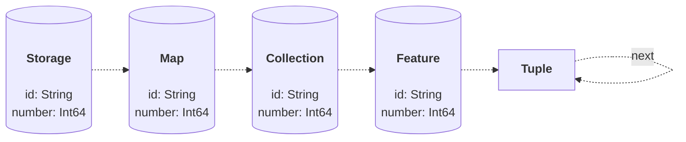

---
## `lib-model` - Everything is a feature
- Within the SAL "everything" is a feature _(except for **Tuple**)_.

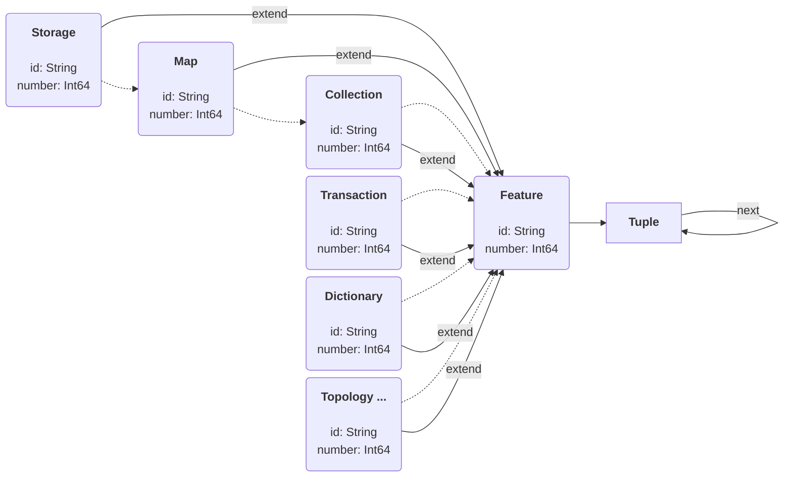

---
## `lib-model` - Addressing
- Within the _Storage Abstraction Layer_ each feature is a container of **Tuple**.
- A **Tuple** is an immutable state of a feature.
- The feature logically points:
  - to the latest state _(HEAD)_, if being alive
  - to the final state _(DELETED)_, if being dead and activated in collection.
  - to all past states _(HISTORY)_, if activated in collection. 

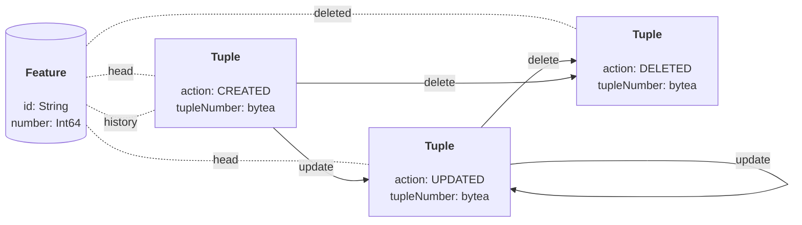
- Every **Tuple** is uniquely addressed using a **Tuple-Number**.

---
## `lib-model` - Tuple Addressing
- Each **Tuple** has a worldwide unique identifier called **Tuple-Number**.
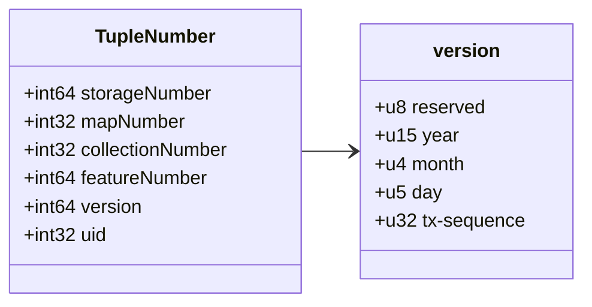
- The **tx-sequence** is a storage unique transaction identifier, reset daily.
- This allows a maximum of ~49,000 transactions per second per storage.
  - Up to the year 4096, the version is 64-bit floating point save _(JavaScript)_.
- The **uid** is a transaction local unique identifier
  - Each transaction can create up to 4 billion new **Tuple**.

---
## `lib-model` - Feature Addressing
- Each **Feature** has a global unique identifier called **GUID**.
- The **GUID** is encoded in the meta-data of a feature.
- The **GUID** is stringified as [URN](https://www.rfc-editor.org/rfc/rfc8141) with three distinct variants:

```text
urn:naksha:guid:{id}[:{stn}:{map}:{col}:{fn}[:{year}:{month}:{day}:{seq}:{uid}]]

edit: urn:naksha:guid:demo
head: urn:naksha:guid:demo:4711:0815:1213:-5386453534
full: urn:naksha:guid:demo:4711:0815:1213:-5386453534:2025:03:20:12:3
```
- **id**: The **id** of the feature.
- **stn**: The **storage-number** of the storage in which the feature is located.
- **map**: The **map-number** of the map in which the feature is located.
- **col**: The **collection-number** of the map in which the feature is located.
- **fn**: The **feature-number** of the feature.
- **year:month:day:seq**: The **version** of the feature.
- **uid**: The transaction local identifier.

**Note**: The encoded date is the day in which the transaction started, that created the referred state _(Tuple)_ of the feature.

---
## `lib-model` - Storage / Maps
All maps always have a virtual collection with **id** `naksha~collection`, used to administrate collections of the map:

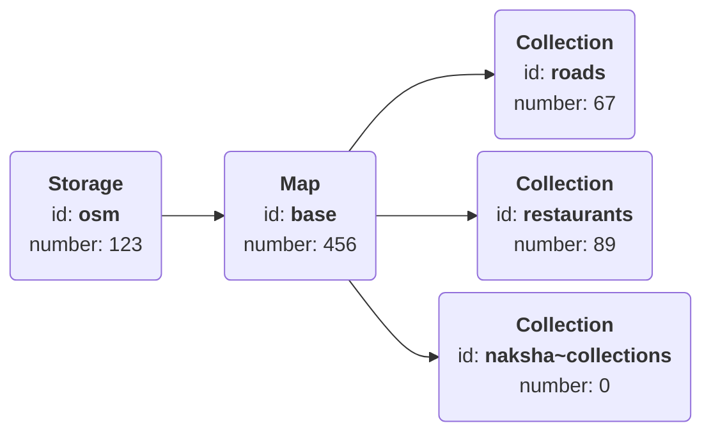

---
## `lib-model` - The chicken-egg problem
As **Storage** and **Map** are **Features**, where are they stored? They should be stored in a **Collection**, but each collection must be stored in a **Map**, so, how can a **Map** itself be stored in a **Collection**?

The answer is: In a special virtual-map in the storage: **`naksha~admin`**

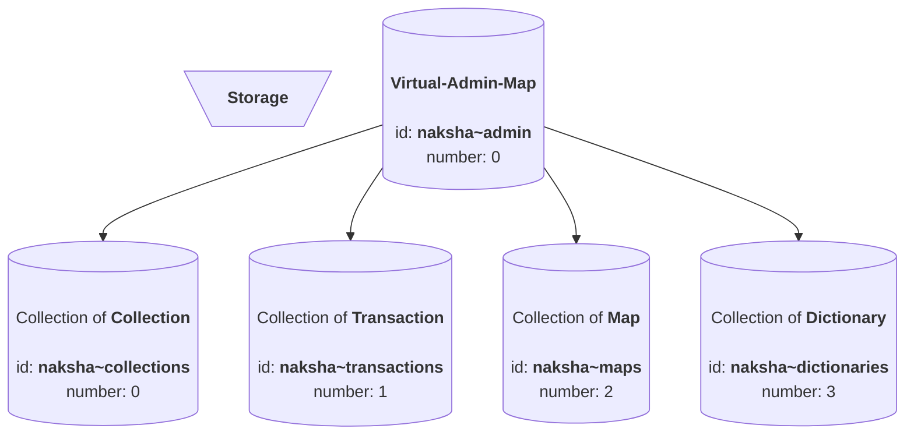

---
## `lib-model` - Feature-Numbers
As every **Feature** has a unique **id** and a unique **number**, the **number** needs to be generated. This happens in two ways:

- If the **id** is a decimal number between `0` and `9,223,372,036,854,775,807` _(`2^63-1`)_, then the number is parsed and used as **feature-number**, always being positive.
- Otherwise, a [md5-hash](https://en.wikipedia.org/wiki/MD5) of the **id** is calculated, and the last 8 byte _(index `8` to `15`)_ are read in [Big-Endian](https://en.wikipedia.org/wiki/Endianness) encoding, setting the sign-bit, becoming the **feature-number**, always being negative.
  - If there is a collision detected `65536` is added, the sign-bit is set again, and the lower 16-bit are restored from the hash. If colliding again, this is repeated until a free number is found.
  - This keeps the lower 16-bit in sync with the original [md5-hash](https://en.wikipedia.org/wiki/MD5).

The **feature-number** of **Map** and **Collection** is limited to 32-bit, therefore in this case the 64-bit number is truncated to 32-bit. The **number** `0` is reserved for internal purpose, and not a valid number for **storage**, **map** or **collection**.
 
Manual **feature-numbers** _(positives)_ and those of **storages**, **maps**, and **collections**, do not implement collision handling. Therefore, should there be two collections with different **id**, but same **feature-number**, they can't be stored, and the **id** needs to be adjusted.

---
## `lib-model` - Performance Partitioning
- The Naksha _Storage Abstraction Layer_ defines how **Tuple** are partitioned.
- The lowest 16-bit of the **feature-number** is by definition the **partition-number** of the feature.
  - This explains why, in the case of a **feature-number** collision, the lower 16-bit are kept in sync with the **id**-hash.
  - We want to ensure, that just by knowing the **id** of a feature, the partition in which all it's **Tuple's** are stored is known.
  - The lower 16-bit are used by intention, to ensure that manually generated sequential **feature-numbers** do partition well, and so that search-results are scattered across partitions by default, to improve read performance _(default order is by **Tuple-Number**)_.
- If a **collection** is not partitioned, then the **partition-number** has no effect
- If a **collection** is partitioned
  - All **Tuple** of a feature are stored in the partition to which their **partition-number** is mapped.
  - Therefore, all states of a **Feature** are guaranteed to be found in the same partition!

---
## `lib-model` - Limitations
The **identifiers** for **Storage**, **Map**, and **Collection** are limited to:

`^[a-z][a-z0-9_:-]{0,41}$`

We do **not** allow upper-case characters _(`A-Z`)_ or dots _(`.`)_ in **identifiers** for **Storage**, **Map**, or **Collection**!

Theoretically, the amount of **Features** is limited to `2^64`, but practically, due to hash collisions, the best one can possibly use is `2^63`, using manual feature numbers _(`9,223,372,036,854,775,807`)_.

The SAL puts a soft-cap on 4 billion features per partition, but generally each collection should be partitioned ones it stores more than 10 million features. It is recommended to create one partition for every 10 million features being expected.

The SAL as well puts a soft-cap to 1000 partitions. Therefore, the soft-cap of the amount of **Features** that can be stored in a collection is limited to around 4 trillion _(`4,294,967,296,000`)_.

These are soft-caps, individual implementations are allowed to have much higher hard-caps, but need to handle collisions accordingly.

---
## `lib-model` - Tuple Details
Each **Tuple** persists out of the following parts:

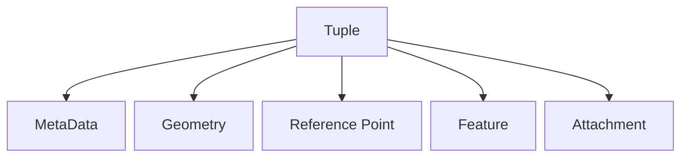

The **Reference Point** can be set, if not set, it is automatically calculated from the **Geometry**. If no **Geometry** is available, it's `null`.

The **Feature** is a JSON of properties, from which **geometry** and **referencePoint** are extracted.

The **MetaData** is read from: `properties->@ns:com:here:xyz`

The **attachment** is a special case, it is an arbitrary binary, not exposed through REST-APIs. It is part of the **Tuple** _(so of the state)_, but handled specially in the SAL.

---
## `lib-model` - Tuple MetaData

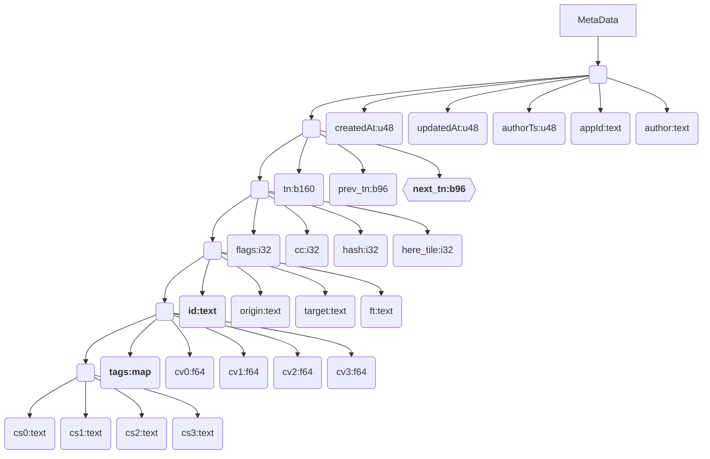
- **here_tile**: Calculated a [HERE binary tile-id at level 15](https://www.here.com/docs/bundle/introduction-to-mapping-concepts-user-guide/page/topics/here-tiling-scheme.html) of the **Reference Point**, alternatively as hash above the **id**.
- **cc**: Change-Count, incremented with each update, start at `1` when a feature is created.

---
## `lib-model` - User/Time Tracking
- Naksha intrinsically comes with a feature called user-/ and time-tracking.
- This can be disabled for each collection setting the **`disableUserTracking`** and/or **`disableTimeTracking`** property to `true`.
- If not disabled, each **Tuple** always has a change-log, which is important to understand who did which changes:
  - Every **Tuple** does always have **appId** and **updatedAt** set to the application that produced this **Tuple** and the time it did this.
  - If the application provides an **author**, then **author** is set to this value, and **authorTs** becomes **null**, which means, it matches **updatedAt**.
  - If the application does not provide an **author** _(`null`)_, then the **author** and **updateTs** of the previous state is copied over into the current **Tuple**, if this is the first **Tuple** _(CREATED)_, then the **appId** is used as **author**, and **authorTs** is _(`null`)_.

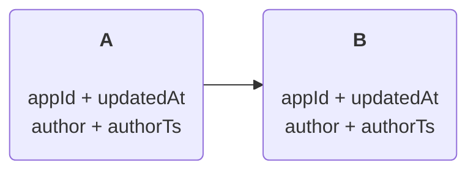

---
## `lib-model` - Transactions
- Within a SAL all changes are part of transaction.
- Each transaction does have a unique **transaction-number**, which for transactions is the same as the **version**.
- Each transaction holds details about what changed.
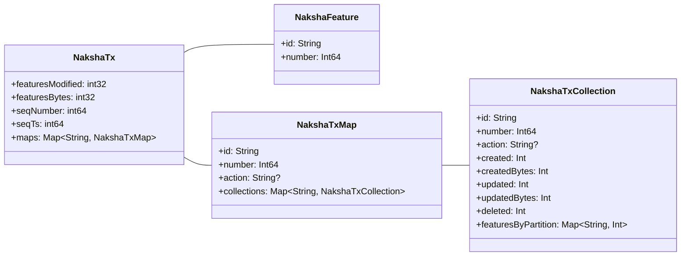

---
## `lib-model` - Two Phase Queries
The SAL defines that all queries are done in two phases, and it introduces a Caching Layer. Therefore, by definition, all queries are executed like:

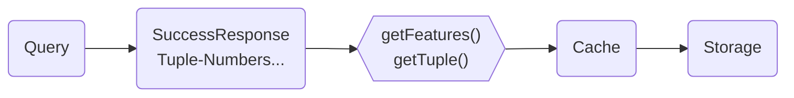
- Perform the query, e.g.
  - _find all features with a certain id_
  - _find all features in a certain bounding box_
- The storage fulfils this query and returns a list of **Tuple-Numbers**, it does not yet have to return the features.
- When the client needs the **Tuple**, the SAL will first ask the cache to return them from cache. What is not found in cache, is then queries from the storage. The tuples can be read in parallel, except the response is part of a not yet committed write.
- This is possible, because **Tuple** are immutable, therefore, the same **Tuple-Number** guarantees to always return the same information.
- One minor exception: **next_tn**
  - This value is set ones there is a new **Tuple**, so caches may not have this information.

---
## `lib-model` - Caching
- The SAL handles in-memory caching
- The SAL allows to implement additional own caching layers
  - For example, caching in Redis, S3, or on ephemeral SSD
- All storages must put loaded **Tuple** into the SAL cache, which is a simple call:
  - `Naksha.cache.store(tuple)`
  - `Naksha.cache.store(tuple, tuple, tuple)`
  - `Naksha.cache.store(tupleList)`

---
# Questions?

**Next: `lib-psql` _(Storage Abstraction Layer implementation)_**

---
# `lib-psql` - The Implementation
- One implementation of the _Storage Abstraction Layer_ is **`lib-psql`**.
- **`lib-psql`** stores data in a PostgresQL database.
- **Maps** are stored as **schemata**.
- **Collections** are stored as a **set of tables**, being:
  - "`{id}`": The _HEAD_ table, storing the latest **Tuple** of the features.
  - "`{id}$del`": The _DELETED_ table, storing all deleted **Tuple**.
  - "`{id}$hst`": The _HISTORY_ table, storing all past **Tuple** of the feature.
    - "`{id}$hst${year}`": The _HISTORY_ is always partitioned by year, so when the **Tuple-Number** is known, we know in which partition this **Tuple** is stored.

---
## `lib-psql` - Partitioning
The `lib-psql` _SAL_ implementation supports partitioning with up to 1000 partitions per collection. If a collection is partitioned, all its tables are partitioned, for example a collection "`foo`" with 4 partitions:

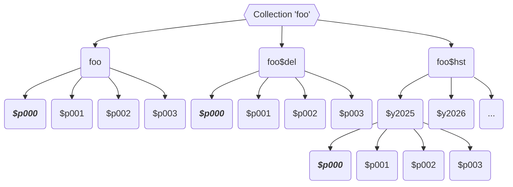

Example, a feature with **id** being `HQzBtA1fQmcg`:
- **feature-number**: `-8109559185894210496`
- **partition-number**: `1088` _(`-8109559185894210496 & 65535`)_
- **partition-index**: `0` _(`1088 % 4 = 0`)
- **partitions**: `foo$p000`, `foo$del$p000`, `foo$hst$2025$p000`, `foo$hst$2026$p000`...

---
# Demo
- Show the Naksha _Storage Abstraction Layer_ API
- Show how to actually use the _Storage Abstraction Layer_ API locally for development and debugging.
- **Note**: Naksha team provides and maintains a PostgresQL docker container, that is compatible to AWS Aurora and RDS instances!
