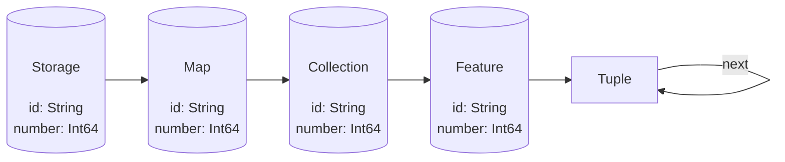
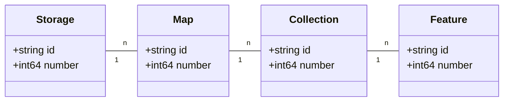

# Naksha Storage Abstraction Layer
- **Status**: Final
- **Revision**: 1

The Naksha Storage Abstraction Layer is one of the data model definitions coming with the Naksha project.

---
## Basics



---
## Test mermaid 2



---
## Unique Identifier Format
This proposal solves the following issues when exchanging data:

* World wide unique object identifier
* The identifier should be compatible with existing identifiers
* The identifier should allow to detect and contact the data source
* Intrinsic synchronization support between different services that host the same object
	- Allow the same object to have different identifiers at different services

---
## Syntax
* Use case insensitive URN's as unique identifiers
	- https://tools.ietf.org/html/rfc2141
* For the NID part _"here"_ is proposed
* Unless this NID is registered with the IANA organization _"x-here"_ shall be used
	- Both NID's (_"here"_ and _"x-here"_) should be treated as being the same, unless another company is able to register the _"here"_ NID

A full qualified identifier should look like this:
```
urn:x-here:<service>:<collection>:<id>[@<hsid>]
```

---
```
urn:x-here:<service>:<collection>:<id>[@<hsid>]
```
* **service**: The unique identifier of the HERE service where this object is hosted
* **collection**: The service local collection identifier within the service
* **id**: The service and collection local identifier of the object. The **id**entifier must not use the at (@) or colon (:).
* **hsid**: The **H**ERE **S**tate **ID**entifier of the object, which is a hex-encoded SHA256 hash above the serialized form of the object. If not provided, then the current (_HEAD_) state is used.
	- The serialization must be defined so that every client and service calculates the same hash for the same object.

---
Everything before the **id** part of an identifier is called **prefix**, so in the following example:
```
urn:x-here:maphub:layer:grp:wiki:NAVLINK_DELTA:4711@ef674332432
```
The above URN should be splitted into this sections:
- **prefix**: "urn:x-here:maphub:layer:grp:wiki:NAVLINK_DELTA"
- **service**: "urn:x-here:maphub"
- **collection**: "layer:grp:wiki:NAVLINK_DELTA"
- **id**: "4711"
- **hsid**: "ef674332432"

Therefore the **prefix** plus the **id** addresses an object. The same is true for the **service** plus **collection** plus **id**.

---
## Examples
```text
urn:x-here:rmob:pvid:<pvid>
	urn:x-here:master:pvid:0815
	
urn:x-here:mapcreator:navlink:<objectId>
	urn:x-here:mapcreator:navlink:4711
	
urn:x-here:mapcreator:place:<objectId>
	urn:x-here:mapcreator:place:4711"
	
urn:x-here:mapcreator:pdl:<pdlId>:<objectId>
	urn:x-here:mapcreator:pdl:bmw:4711
	
urn:x-here:maphub:layer:<prefix>:<ownerName>:<layerName>:<objectId>
	urn:x-here:maphub:layer:grp:wiki:WIKI_NAVLINK_DELTA:4711

urn:x-here:maphub:view:<prefix>:<ownerName>:<viewName>:<pipelineName>:<nodeName>:<objectId>
	urn:x-here:maphub:view:wikvaya:mc:v1:navlink:navlink_delta:4711
```

---
## Clients
* Clients are able to split each identifer apart into: **service**, **collection**, **id** and _optionally_ **hsid**
* This allows the client to query for the object and to internally create data storage structures
* When a client uses multiple data sources, it is able to track which object came from which data source

---
## The service domains
Create a HERE company wide service registry where each service registers itself with its HERE unique service domain:
```
service = ["<prefix>-]<domain>[-<postfix>]"
```

* Protect each **prefix**, **domain** and **postfix** combination with a public/private key to prevent identity theft
	- Allow an _catch all_ rules for _prefix_ and _postfix_, for example the same key can be used to register any _"user-johndoe-{postfix}"_ service
* Reserved domains are:
	- **"master"** as the one and only source of truth
	- **"id"** for special purpose
	- **"v{version}"** for special purpose
* Reserved prefixes are:
	- **"dev"**, **"int"** and **"st"** for special environments
	- **"user"** for personal _user_ specific environments

---
## Example of valid service identifiers
```
// Map Creator front-end development environment
"dev-mapcreator-fe" // middleware
"dev-maphub-fe" // back-end
	
// Map Creator back-end development environment
"dev-mapcreator-be" // middleware
"dev-maphub-be" // back-end
	
// Map Creator staging environment
"st-mapcreator"
"st-maphub"

// Personal purpose environment
"user-johndoe-mapcreator"
"user-johndoe-maphub"
```

---
## Staging and development environments
When objects are hosted at development or staging environments, this is detectable by their identifiers:
```
// production object
urn:x-here:mapcreator:navlink:4111

// staging object
urn:x-here:st-mapcreator-fe:navlink:4711

// development object at a personal local development machine
urn:x-here:user-johndoe-mapcreator:navlink:4111
```
